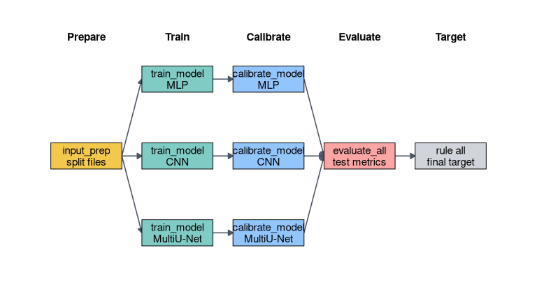
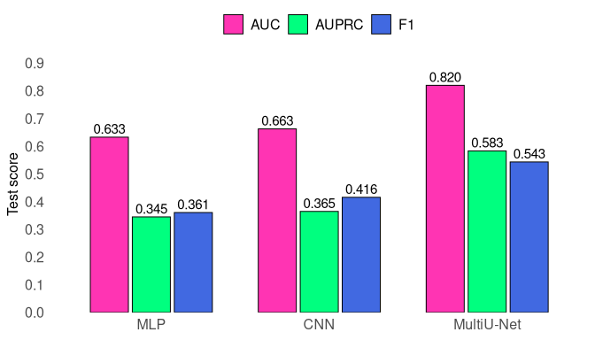
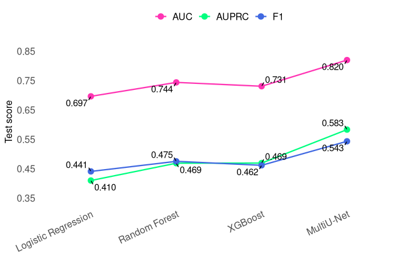
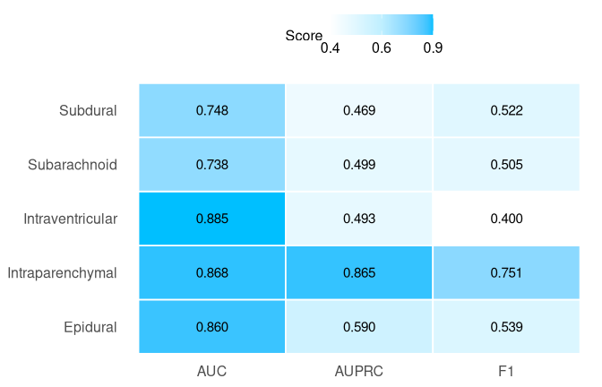
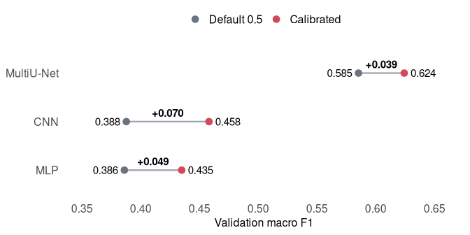

Tier 3 Neural Network Models for Hemorrhage Subtype Classification
================
Ngoc Linh Nguyen

## Background

This is a report of Tier 3 neural-network models for multi-label
intracranial hemorrhage subtype classification from brain CT slices. The
5 modeled labels are epidural, intraparenchymal, intraventricular,
subarachnoid, subdural hemorrhage. The cohort is hemorrhage-positive by
construction, so the `any` hemorrhage label is excluded.

This project follows earlier Tier 1 and Tier 2 experiments by Hridik
Punukollu (github.com/punss/brain-ct-hemorrhage) that used the same
cohort construction rules and the same train/validation/test split
definitions. The shared data-definition process linked rendered CT
images, classification labels, and segmentation polygon annotations
before modeling. Those earlier tiers did not train on image tensors
directly. Instead, each CT slice was represented by a 269-dimensional
handcrafted feature vector summarizing intensity histograms, summary
statistics, radial zones, thresholded regions, cross-channel
differences, and texture. Models were trained in a one-vs-rest framework
with per-label threshold calibration on the validation split.

The main Tier 1 result was a Logistic Regression baseline with test
macro AUC 0.697, macro AUPRC 0.410, and macro F1 0.441. Tier 2 ensemble
and kernel models improved this baseline. Random Forest achieved the
highest reported Tier 1/Tier 2 test macro AUC, 0.744, and macro F1,
0.475; XGBoost achieved the highest macro AUPRC, 0.469. Across the
earlier tiers, intraventricular hemorrhage was comparatively detectable
despite low prevalence, while subarachnoid and subdural hemorrhages were
more difficult. Classifier chains did not materially improve
performance.

Tier 3 tests whether direct spatial learning from the CT tensors
addresses the limitations of the handcrafted representation. The central
question is not only whether neural networks improve classification, but
whether adding segmentation supervision improves the learned image
representation for hemorrhage subtype detection. To keep the comparison
meaningful, Tier 3 retains the same case universe, split membership,
macro metrics, and validation-threshold calibration strategy used in
Tiers 1 and 2. The intended contrast is therefore representation and
modeling strategy, not a change in test set or evaluation rules.

## Data

The dataset preparation workflow is present in this repository. The
dataset was constructed from rendered CT images, classification labels,
and human segmentation polygon tables. The final cohort contains 2,929
CT slices. Each case is stored in a TensorFlow TFRecord as a 512 x 512 x
4 float tensor formed from four rendered CT windows: brain-bone, brain,
max-contrast, and subdural. The same serialized record also contains the
six original classification labels, the rasterized 512 x 512 x 1 binary
segmentation target, and metadata fields keyed by `meta_index`. The
modeling scripts drop the cohort-level `any` hemorrhage label at parse
time, leaving 5 subtype labels for classification.

The preparation pipeline retained cases only when all four render
windows were available, classification labels were present, and at least
one usable segmentation annotation was available. Flagged IDs were
excluded. When multiple segmentation annotations were available, the
pipeline preferred Correct labels over Majority labels, then higher
agreement and read-count fields. The final modeling dataset contains
1,369 cases using Correct segmentation labels and 1,560 cases using
Majority labels.

Splits were defined during the Tier 1/2 workflow, which was based on the
TFRecord. Tier 3 retained this split membership by carrying forward the
same case identifiers from T1/T2. `scripts/input_prep.py` validates the
train, validation, and test `meta_index` files against the manifest,
checks for empty files, duplicates, invalid IDs, and split overlap, and
then writes run-local split files under `runs/<run_name>/splits/`. If
valid handoff files are not available, the script can fall back to a
stratified random split by `render_directory`, but this reported run
used the provided split source. The resulting split was 2,049 training
cases, 440 validation cases, and 440 test cases. The order of cases
within each split was shuffled before training so that within-epoch
training order was not tied to the original metadata ordering
(membership of the train, validation, and test splits was unchanged).

## Methods

### Experimental Set-up

The Tier 3 experiment was implemented as a Snakemake-managed workflow
around small Python scripts. This was useful because input preparation,
model training, threshold calibration, and final evaluation were kept as
separate stages with explicit inputs and outputs. The test set was only
used in the final evaluation stage. For comparability with the Tier 1/2
experiments, model selection used the same validation/test split logic
and the same macro-averaged AUC, AUPRC, and calibrated-F1 framing, while
replacing the 269-dimensional handcrafted feature vector with learned
representations from the raw four-channel image tensor.

<strong>Fig. 1.</strong> Snakemake DAG for the Tier 3 neural-network
workflow.

The DAG shows the workflow as a sequence of explicit Snakemake rule
dependencies. Input preparation produces the retained train, validation,
and test split files. Training then fans out across the configured
neural model families. Threshold calibration uses each trained model and
the validation split, and final evaluation applies the fixed weights and
calibrated thresholds to the held-out test split before the default
`all` target is satisfied. The corresponding scripts are
`scripts/input_prep.py`, `scripts/train_mlp.py`, `scripts/train_cnn.py`,
`scripts/train_multiunet.py`, `scripts/calibrate_thresholds.py`, and
`scripts/evaluate_all.py`. Common configuration, TFRecord parsing, Keras
compilation, inference, and metric helpers live under `scripts/shared/`.

The Python environment was defined by `env.yaml` with Python 3.12,
NumPy, pandas, scikit-learn, PyYAML, and Snakemake. Neural training used
TensorFlow through the ROCm build (`tensorflow-rocm` 2.19.1) rather than
CUDA. The reported run executed on a consumer AMD Radeon RX 6600 GPU,
with about 6.8 GiB visible to TensorFlow. Batch sizes were kept
model-specific for memory: 16 for the MLP, 8 for the CNN, and 4 for the
MultiU-Net.

The TensorFlow input path is implemented in
`scripts/shared/tfrecord_utils.py`. Rather than streaming the full
TFRecord sequentially and filtering after decoding, the code first
builds a byte-offset index from `meta_index` to each serialized record.
Split datasets then shuffle the small integer `meta_index` stream for
training, read only the requested records, parse tensors with
`tf.io.parse_single_example` and `tf.io.parse_tensor`, enforce the
configured tensor shapes, batch examples, and prefetch with
`tf.data.AUTOTUNE`. Classification-only models receive `(x, y_cls)`
batches, while MultiU-Net receives multitask targets with both `cls` and
`seg` outputs.

All neural models were implemented with the Keras functional API and
saved as Keras model artifacts. The shared experimental machinery here
is the same across model families except where the multitask model
requires segmentation targets and a second output. Training uses Adam
with learning rate `1E-4`, maximum 50 epochs, early stopping on
validation loss with patience 5, restoration of the best validation-loss
weights, and a Keras model checkpoint for the saved model. The scripts
compute positive-class weights from the training split and use custom
weighted binary cross-entropy for classification losses. MultiU-Net is
compiled with two outputs: weighted binary cross-entropy for
classification and Dice plus binary cross-entropy for segmentation, with
equal classification and segmentation loss weights.

After training, `scripts/calibrate_thresholds.py` reloads each saved
model and sweeps per-label thresholds from 0.05 to 0.95 in 0.01
increments on the validation split, choosing the threshold that
maximizes binary F1 for each hemorrhage subtype. This mirrors the
earlier-tier treatment of thresholding: AUC and AUPRC evaluate ranking
quality without a threshold, while F1 evaluates the hard decision rule
after validation-only calibration. `scripts/evaluate_all.py` then
reloads the saved weights and calibrated thresholds, runs held-out test
inference, writes per-model classification metrics, per-case
predictions, and segmentation Dice for MultiU-Net, and computes AUC,
AUPRC, and F1 through scikit-learn helper functions.

Before the final run, experimentation focused mainly on target validity
and training behavior rather than broad hyperparameter search.
Diagnostic runs checked that split membership was preserved,
segmentation masks were non-empty when expected, training order was
shuffled, memory use was controlled, and validation losses behaved
plausibly. The most important methodological adjustment was changing the
MultiU-Net mask objective to Dice plus binary cross-entropy after
Dice-only segmentation training proved weak. Model families and
multitask loss weights were then held fixed for the reported comparison.
This restraint is intentional as the point of Tier 3 is to test whether
spatial and segmentation-aware representation learning addresses the
earlier tiers’ limitations, not to win a large architecture or
hyperparameter search.

### Final Neural Models

Three final neural model families were evaluated:

**Table 1. Neural model families evaluated in Tier 3.**

| Model | Role in comparison | Input handling | Main architecture | Output |
|:---|:---|:---|:---|:---|
| MLP | Non-spatial neural baseline | Downsample `512 x 512 x 4` tensor to `64 x 64`, then flatten | Dense layers with hidden sizes `[512, 256]`, dropout, batch normalization | 5 sigmoid classification probabilities |
| CNN | Spatial image-classification baseline | Full `512 x 512 x 4` tensor | Convolution and pooling blocks with filters `[8, 16, 32, 64, 128]`, global avg pooling, dense classification layer | 5 sigmoid classification probabilities |
| MultiU-Net | Multitask segmentation-classification model | Full `512 x 512 x 4` tensor | U-Net style encoder-decoder with encoder filters `[16, 32, 64, 128]`, bottleneck `256`, decoder filters `[128, 64, 32, 16]`, and a classification head using global and segmentation-weighted features | 5 sigmoid classification probabilities plus one hemorrhage mask |

The three-model design deliberately separates representation questions
that were unresolved after Tiers 1 and 2. The MLP is a non-spatial
neural baseline: it can combine channel intensities nonlinearly, but
downsampling and flattening discard much of the local geometry that
distinguishes peripheral, ventricular, and parenchymal hemorrhage
patterns. The CNN keeps the full tensor and uses local filters, so it
should recover spatial motifs that the MLP cannot. Its tradeoff is that
the only supervision is image-level subtype presence, and global pooling
can still reward diffuse correlations without forcing the network to
identify the hemorrhage region. The MultiU-Net adds a segmentation
objective and a segmentation-weighted classification pathway. That gives
denser pixel-level supervision and a stronger localization bias, but it
also increases memory use, depends on heterogeneous mask annotations,
and introduces the possibility that the segmentation and classification
losses compete during optimization. This last detail risks causing one
component to essentially become meaningless or an active hindrance to
the other.

The training and loss design was kept deliberately simple.

**Table 2. Training and loss design.**

| Component | MLP | CNN | MultiU-Net |
|:---|:---|:---|:---|
| Classification loss | Weighted binary cross-entropy | Weighted binary cross-entropy | Weighted binary cross-entropy |
| Segmentation loss | Not applicable | Not applicable | Dice plus binary cross-entropy |
| Loss weights | Classification only | Classification only | Classification `0.5`, segmentation `0.5` |
| Batch size | 16 | 8 | 4 |
| Batch normalization | Yes | Yes | No |
| Optimizer | Adam | Adam | Adam |
| Learning rate | `1E-4` | `1E-4` | `1E-4` |
| Maximum epochs | 50 | 50 | 50 |
| Early stopping patience | 5 | 5 | 5 |
| Best epoch | 3 | 4 | 49 |
| Stopping reason | Ran out of patience | Ran out of patience | Reached maximum epochs |

The key loss choice was to keep classification comparable across models
while adding mask supervision only where the architecture could use it.
Weighted binary cross-entropy addressed subtype imbalance for all
classification heads, serving the same purpose as class weighting in the
earlier one-vs-rest models. Dice plus binary cross-entropy was used for
the MultiU-Net mask because hemorrhage occupies a small fraction of each
image: Dice emphasizes overlap with the small foreground region, while
binary cross-entropy stabilizes pixelwise learning and discourages
degenerate all-background masks. Equal classification and segmentation
loss weights avoided an additional task-weight tuning step, but this is
a design compromise rather than a claim of optimal weighting.

As in the earlier tiers, each model underwent per-label threshold
calibration on the validation split, optimizing binary F1 independently
for each subtype. This keeps the hard-decision comparison aligned with
the T1/T2 design and prevents default 0.5 thresholds from dominating
conclusions under label imbalance. Final F1 used those calibrated
thresholds.

## Results

Tier 3 evaluated 440 held-out test cases for each of the 3 neural
models. Macro-averaged test results are shown below.

**Table 3. Macro-averaged test performance for Tier 3 models.**

| Model      | Test macro AUC | Test macro AUPRC | Test macro F1 |
|:-----------|---------------:|-----------------:|--------------:|
| MLP        |          0.633 |            0.345 |         0.361 |
| CNN        |          0.663 |            0.365 |         0.416 |
| MultiU-Net |          0.820 |            0.583 |         0.543 |

<strong>Fig. 2.</strong> Macro test performance for the three Tier 3
neural models.

The ranking was unambiguous. The CNN improved over the MLP by 0.030
macro AUC, 0.020 macro AUPRC, and 0.055 macro F1, indicating a modest
gain from preserving spatial structure and using convolutional filters.
However, the classifier-only CNN still remained below the strongest Tier
1/Tier 2 handcrafted-feature models. This is a useful negative result:
replacing handcrafted features with a generic image classifier did not
by itself solve the precision and surface-hemorrhage problems described
in the earlier-Tier work. The CNN had more spatial capacity than the
MLP, but its supervision was still only an image-level label vector.

The MultiU-Net was the strongest model by every macro classification
metric. Relative to the CNN, it improved macro AUC by 0.157, macro AUPRC
by 0.219, and macro F1 by 0.128. The largest gain was in AUPRC, the
metric that was most problematic in Tiers 1 and 2. That pattern is
consistent with the model-design hypothesis: **segmentation supervision
appears to improve not only ranking, but the precision of positive
subtype predictions under imbalance**.

The cross-tier comparison is therefore concentrated in the MultiU-Net
result rather than in neural modeling alone.

**Table 4. Cross-tier comparison across all models.**

| Model | Tier | Test macro AUC | Test macro AUPRC | Test macro F1 |
|:---|:---|---:|---:|---:|
| **Logistic Regression** | **Tier 1** | **0.697** | **0.410** | **0.441** |
| LDA | Tier 1 | 0.676 | 0.395 | 0.434 |
| QDA | Tier 1 | 0.688 | 0.381 | 0.454 |
| GNB | Tier 1 | 0.659 | 0.358 | 0.429 |
| KNN | Tier 1 | 0.682 | 0.402 | 0.416 |
| **Random Forest** | **Tier 2** | **0.744** | **0.469** | **0.475** |
| SVM | Tier 2 | 0.721 | 0.446 | 0.471 |
| **XGBoost** | **Tier 2** | **0.731** | **0.469** | **0.462** |
| MLP | Tier 3 | 0.633 | 0.345 | 0.361 |
| CNN | Tier 3 | 0.663 | 0.365 | 0.416 |
| **MultiU-Net** | **Tier 3** | **0.820** | **0.583** | **0.543** |

<strong>Fig. 3.</strong> Cross-tier macro performance comparison.

Relative to the best earlier-tier results, the MultiU-Net improved macro
AUC from 0.744 to 0.820, macro AUPRC from 0.469 to 0.583, and macro F1
from 0.475 to 0.543. This comparison is somewhat defensible because the
split and metric protocol were carried forward from the T1/T2 work. It
is however not a claim of exact comparability, or that the Tier 3 models
received identical development effort. The earlier models used
randomized hyperparameter search over classical estimators, while Tier 3
used a small, fixed set of neural architectures. The more relevant point
is that segmentation-guided spatial learning appears to address the
earlier feature-tier ceiling better than either a non-spatial MLP or a
classification-only CNN. The largest absolute gain was in AUPRC, which
is important because AUPRC is the stricter metric under label imbalance:
it reflects whether positive predictions are precise, not only whether
positive cases tend to rank above negative cases.

<strong>Fig. 4.</strong> Per-label MultiU-Net test performance.

The per-label results show that the macro improvement was not driven by
a single subtype. MultiU-Net AUC exceeded 0.85 for epidural,
intraparenchymal, and intraventricular hemorrhage. Intraparenchymal
hemorrhage was the strongest label overall, with AUPRC 0.865 and F1
0.751. Intraventricular hemorrhage had the highest AUC, 0.885,
consistent with the earlier tiers where it was comparatively detectable
despite low prevalence. Its lower F1, 0.400, indicates that the model
ranked cases well but struggled to convert that ranking into stable hard
predictions. This is plausible for the rarest label, where small
threshold or count changes can move F1 substantially.

Subarachnoid and subdural hemorrhages remained the hardest labels by
AUC. Those labels were also noted as difficult in Tier 1/2 work for
handcrafted features because their signal is spatially diffuse and
peripheral, and a segmentation-guided model does not automatically make
subtle surface blood easy. Their AUPRC and F1 values were nevertheless
materially better than the classifier-only neural baselines, and
subdural performance improved over the earlier handcrafted-feature
ceiling. This partly supports the Tier 3 motivation: spatial supervision
appears to help with surface hemorrhage patterns, especially for
precision-oriented metrics, although it does not eliminate them as
failure modes.

The MultiU-Net also produced a mean test Dice score of 0.491 at
segmentation threshold 0.5, compared with 0.514 on the validation split.
This segmentation metric has no Tier 1/2 analogue, but the test value
being close to validation suggests that the mask output generalized
reasonably rather than reflecting a validation-only artifact. The Dice
score is not high enough to present the model as a “mature” segmenter,
but it is high enough to support the segmentation head as a meaningful
auxiliary task.

Threshold calibration again mattered. Validation macro F1 improved from
0.386 to 0.435 for the MLP, from 0.388 to 0.458 for the CNN, and from
0.585 to 0.624 for the MultiU-Net.

<strong>Fig. 5.</strong> Validation macro F1 before and after threshold
calibration.

The calibration gains were smaller for MultiU-Net because its
default-threshold performance was already stronger. For the weaker
classifiers, calibration partially compensated for poor probability
scaling and label imbalance, but it did not close the gap to the
multitask model. This mirrors the T1/T2 finding that threshold
calibration is necessary but limited: it can choose a better operating
point for a learned ranking, but it cannot create spatial evidence that
the representation failed to learn.

## Discussion

The main finding is not simply that neural networks beat earlier models.
Direct neural classification alone was actually not sufficient: the MLP
was weak, and the CNN only modestly exceeded it while remaining below
the strongest T1/T2 handcrafted-feature models. This matters because the
earlier features were not arbitrary tabular summaries; they encoded
clinically relevant spatial proxies such as rings, thresholded regions,
and texture. A generic CNN had access to the raw image tensor, but it
also had to learn useful localization from image-level labels alone. The
results suggest that, at this sample size and without an image
augmentation step, spatial capacity without explicit localization
supervision is not enough.

The decisive improvement came from combining image-level classification
with segmentation supervision. This supports the theoretical tradeoff
built into the MultiU-Net: the model pays a cost in memory, optimization
complexity, and dependence on imperfect mask labels, but gains a dense
auxiliary task that pushes shared features toward hemorrhage-localized
evidence. The fact that the largest cross-tier gain was in AUPRC is
especially pertinent. Tiers 1 and 2 could rank cases moderately well,
but the precision-recall gap exposed how hard it was to make precise
positive predictions under label imbalance. Segmentation-guided features
appear to help convert ranking signal into more useful positive
predictions.

The per-label pattern is also consistent with the earlier-Tier
experiments. Intraventricular hemorrhage remained comparatively
detectable because the signal is anatomically concentrated and visually
distinctive. Subarachnoid and subdural hemorrhages remained lower by AUC
because thin, peripheral, and spatially diffuse surface blood is
intrinsically harder to summarize or localize. The MultiU-Net improved
these labels most clearly in precision-oriented terms, but it did not
erase the morphology-driven difficulty that appeared in the
handcrafted-feature tier.

The segmentation result is important but should be interpreted
cautiously. A mean Dice score near 0.49 is meaningful for this
small-foreground task, but it is not high enough to treat the mask
output as a good segmentation product. Its value here is primarily as an
auxiliary supervision signal and as evidence that the model is learning
a hemorrhage-relevant spatial representation. A true segmenter would
require a more direct segmentation study, including a larger dataset of
annotation-quality analysis and visual review.

Several limitations remain. The cohort contains only hemorrhage-positive
cases, so these results do not evaluate normal-versus-hemorrhage
screening. The test set has only 440 cases, making per-label F1 unstable
for rare labels such as intraventricular hemorrhage. Segmentation labels
combine Correct and Majority annotations, so mask quality is
heterogeneous. Finally, this experiment was done with a single retained
split rather than a repeated-split or external validation study.
